# Together Go (ToGo)

| WELCOME TO ToGo(Together Go) |

----------------
| Introduction |
----------------

TOGO is a platform for the students and faculty to maintain a mutual communications between them. ToGo is a JAVA based web application that helps to make the task submission very easy for both faculty and student. Student needs to be signed up in the system to get the system features. For the faculty registration, admin will handle the registration and will give an individual id to every faculty.

Thank you everyone.

>> YouTube video link: 

-------------------
| Required System |
-------------------

 >> Any version of windows operating system.
 
 >> MySQL Workbench 8.0 CE
 
 >> IntelliJ IDEA 2022.1.1

--------------------------
| Minimum Specifications |
--------------------------

    1. Operating System : Windows® 8/10/11
    2. Processor	: Intel® Core™ i3
    3. Memory		: 2 GB RAM
    4. Graphics		: NVIDIA MX130
    5. Network		: Broadband Internet Connection
    6. Storage		: 1 GB

--------------
| How to run |
--------------

 >> First you have to download and install Workbench and IntelliJ software.
 >> Create the database for the ToGo. There is a sql file named "app.sql". Run the queries on the workbench.
 >> Open the ToGo folder from the IntelliJ.
 >> Press on the run button from toolbar.
 >> You will be landed on the ToGo homepage.

--------------------
| How to use "TOGO" |
--------------------

 >> 1. ToGo is a higly secured web based application.
 >> 2. There are basically 3 users: Admin, Faculty and Student
 >> 3. Admin have his own Id and password.
 >> 4. Input admin ID and Password to get access to the admin section. Admin ID and Password is:
	ID	: TO-ADMIN-GO
	Password: ADad<2020>
 >> 5. SignUp is only available for the students. Faculty will be added by the admin.
 >> 6. For changing password, you must match the previous password first.
 >> 7. In case of forget password, you will get a mail on your valid mail address to get the OTP to verify yourself.
 >> 8. For Student ID, you have to use the pattern: XX-XXXXX-X at the time of signup.
 >> 9. For adding any Faculty, Faculty ID need to follow the pattern: XXXX-XXXX-X.

	   Admin :
		   1. Admin needs the administrator id and password to login.
		   2. Admin can add faculty in the system.
		   3. Available faculty's profile can be viewed by the admin.
		   4. If the faculty designation is changed, admin can change the profile of the faculty from edit option.
		   5. Moreover, admin has the power to remove any faculty from the system. In that case, every data associated with that faculty id will be automatically deleted

	   Faculty:
		   1. Faculty can create a classroom, modify it and also can delete the classroom.
		   2. Assign task for that classroom. Task can be re-assigned with some changes as well.
		   3. He/she can accept the join request came from the students.
		   4. Faculty can see the link of the task or the text submission of a student.

	   Student:
		   1. After registration, student can view the classrooms and He/she can apply to join a classroom.
		   2. A student can search a classroom by the name of the classroom.
		   3. If the join request is accepted by the faculty, he/she can see the task assigned with the classroom.
		   4. He/she can submit the task link or text of a running task.
		   5. If any student wants to make a re-submission of any task, the task status needs to be in Running stat.

---------------------------
| Background Informations |
---------------------------

ToGo stands for Together Go. In the terms of submission of any task in the institutions, we have to face many problems. To resolve the problem, we have introduced ToGo with a view to make a disciplined way of task submission. It also helps to build a knowledge of time maintaining. It is the most easier way to make a better task submission.

----------------------------
| Developer's Informations |
----------------------------
	 1. Niloy Kanti Paul
		Email		: niloykantipaul@gmail.com
		LinkedIn	: https://www.linkedin.com/in/niloy-kanti-paul-5543181ab/
		Github		: https://github.com/DEV-NKP

	 2. Kaushik Biswas
		Email		: biswaskaushik.2020@gmail.com
		LinkedIn	: https://www.linkedin.com/in/kaushik-biswas-2b6554243/
		Github		: https://github.com/Kaushik-Biswas

	 3. Dipanwita Saha
		Email		: dipanwitasaha7009@gmail.com
		LinkedIn	: https://www.linkedin.com/in/dipanwita-saha-a772aa215/
		Github		: https://github.com/Dipanwita-Saha
		
		

----------------------
| Project Highlights |
----------------------

> ToGo has it's own unique logo.

> ToGo is designed with a beautiful, attractive and charming landing page. This attracts the most when you first hop into the ToGo.
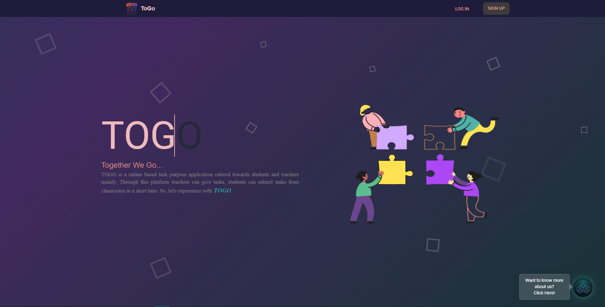

> In this about section you will get to know about the ToGo.
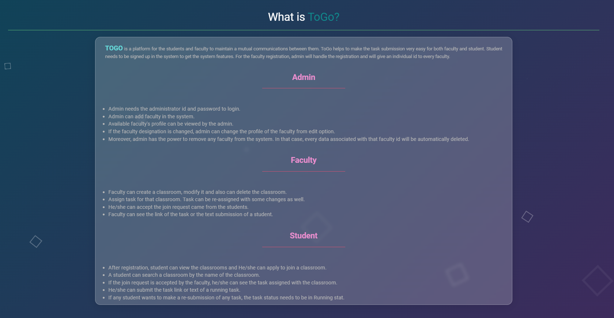

> You may login here to get access of the ToGo.
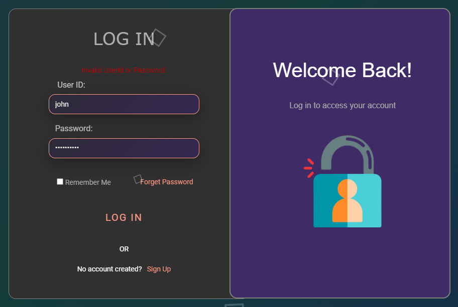

> Only students are welcomed to signup through this form. Admin will add the faculty from admin end.
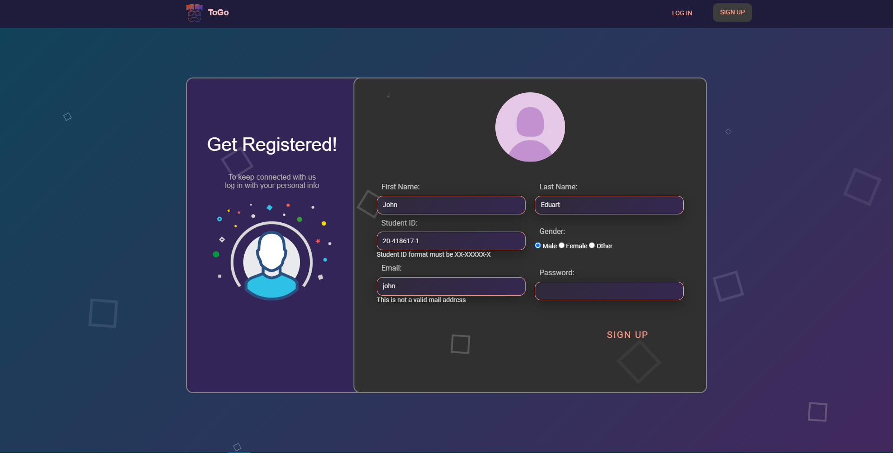

> You can change your password but make sure you have inputted your previous password accurately.
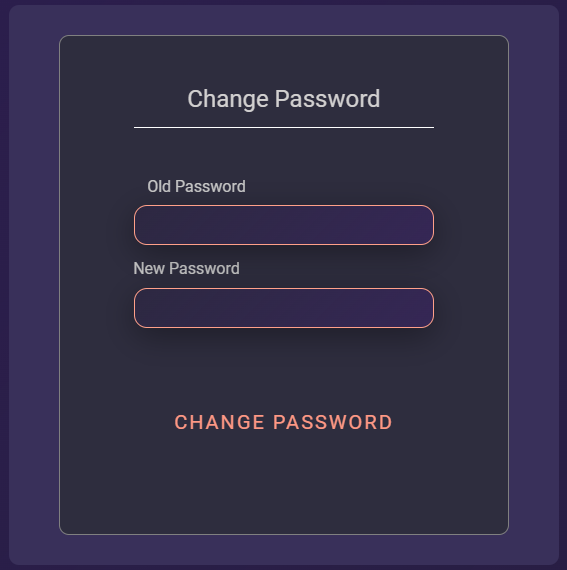

> If you have forgot your previous password, enter your emai to get OTP, verify yourself and enter your new password.
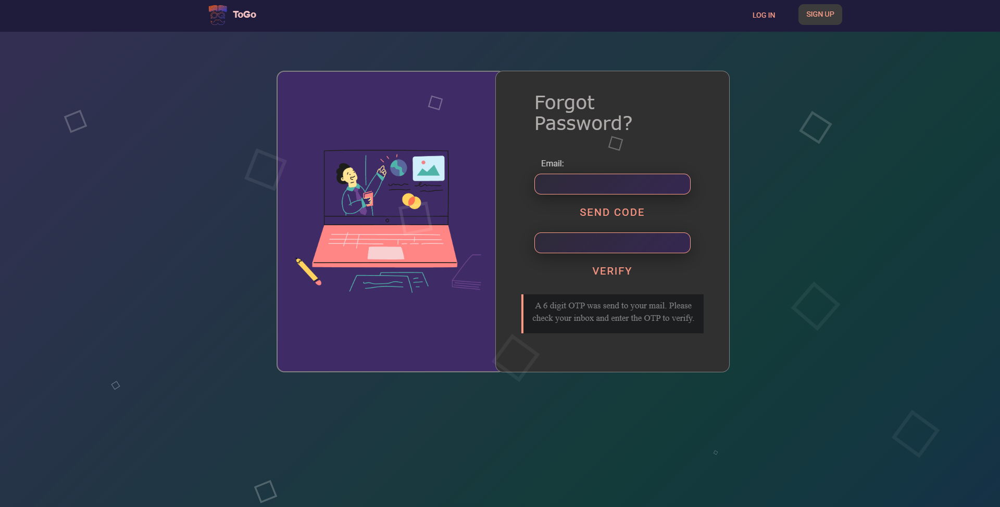

> All three users have their own designed and dedicated profile from which they can edit their informations.
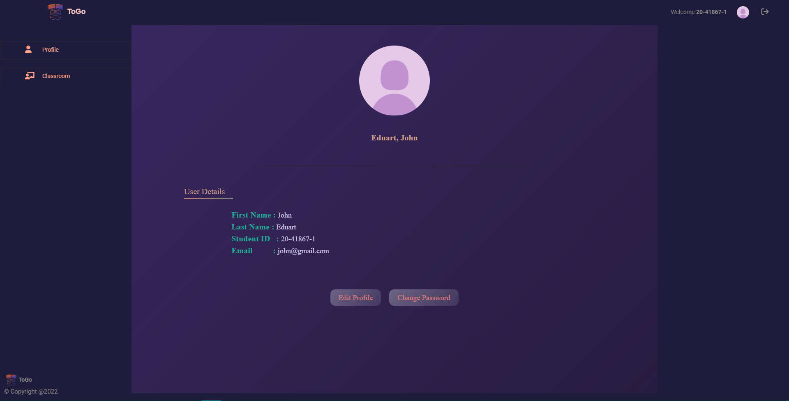

> Admin can add any faculty in the system.
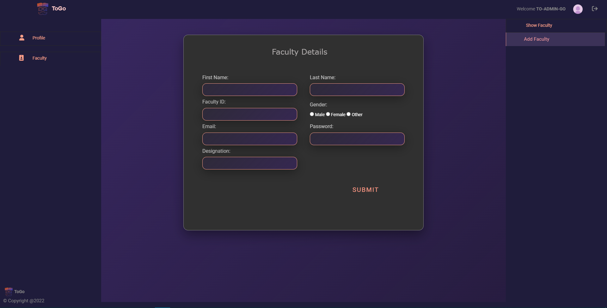

> Admin can view all the faculty list who are joined in the system.
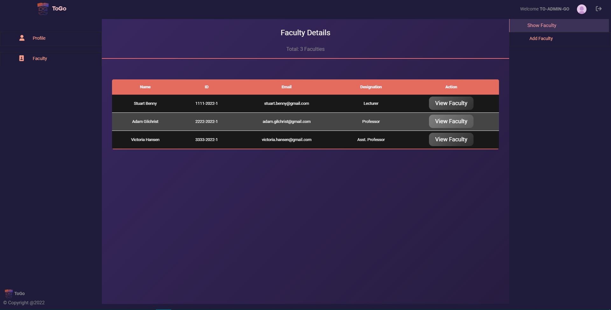

> Faculty can add a classroom for any course he is associated with.
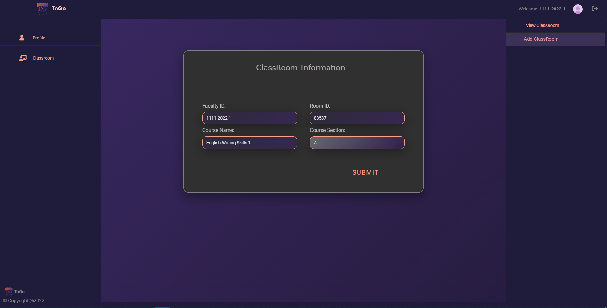

> A faculty can view all the classrooms he has created.
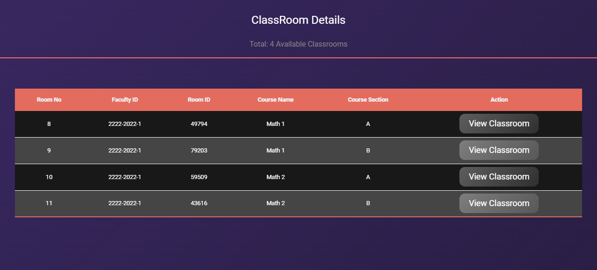

> A particular class informations can be edited or be deleted by a faculty.
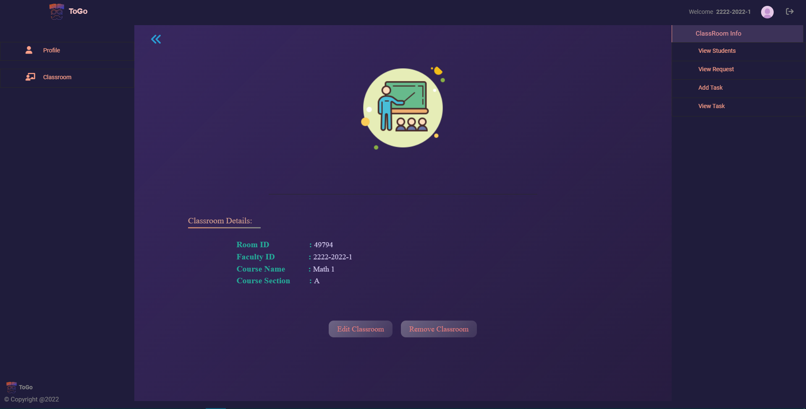

> Students join requests can be seen by the faculty in a table.
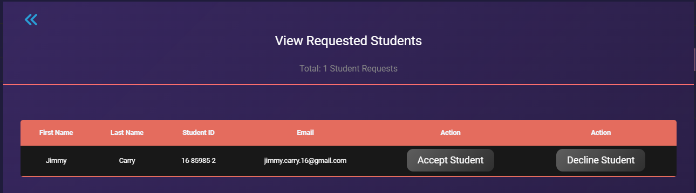

> After creating a classroom, a faculty can add task to that classroom.
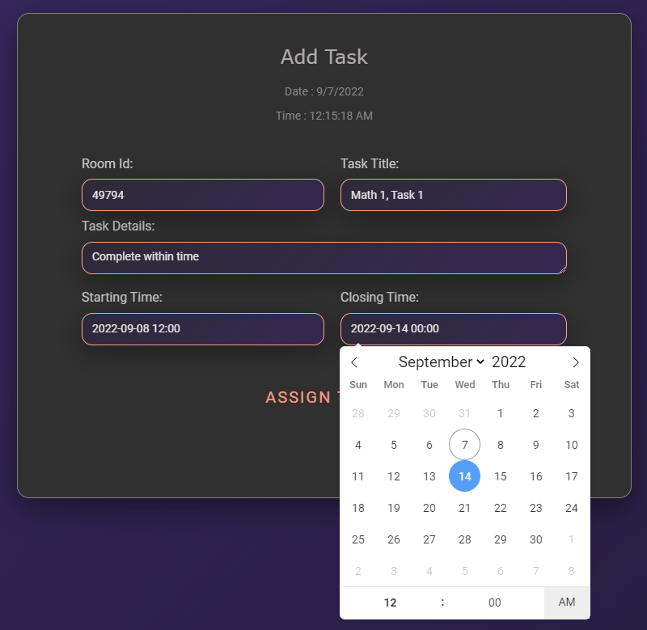

> A faculty can view all the tasks along with the status.
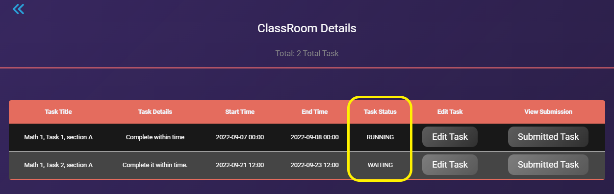

> After student's task submission there is a interface in which a faculty will get to know who have already submitted and what is the time remaining for the task.
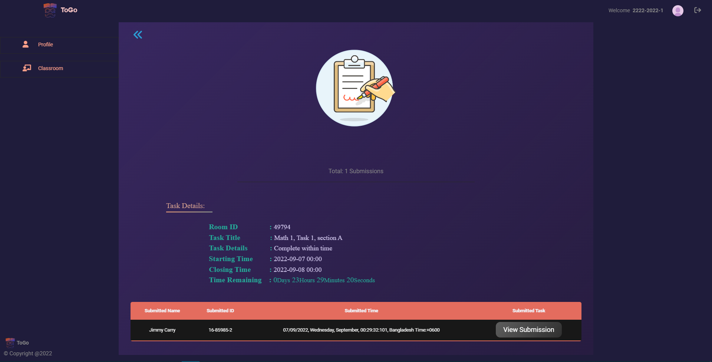

> Student can view the classroom tasks and can submit if the task is a running task.
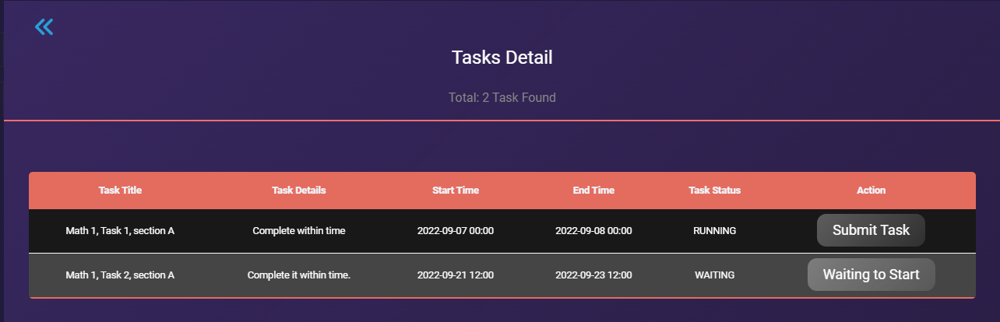

> Student can submit the task until the task time is running. He/she can add a link or text message as well.
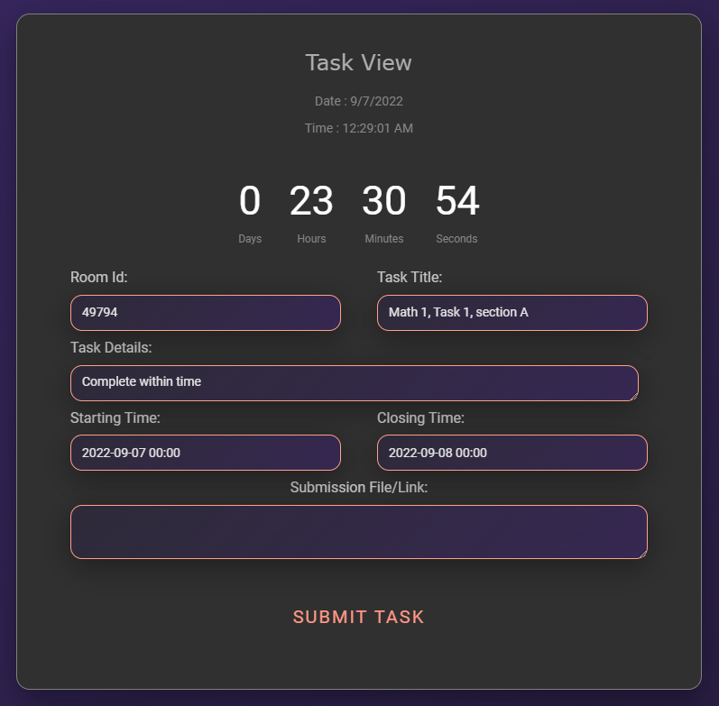

> If any student already submitted any task, he can resubmit the task. But he/she has to make sure that the status of the task is still "Running".
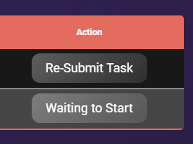

********************************************ⒸAll Rights Reserved By "TEAM_TORTOISE"********************************************

